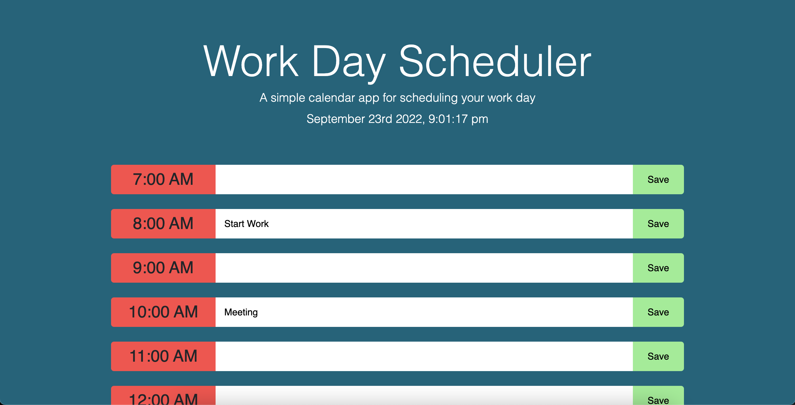

# Work-Schedule

This is an app that helps keep track of your day.

## Description

This project helps with your day to day routine. You can type a note into the time slot and click the save button and then it will save.

## Image

## Usage

This is used to jot down any notes, ideas, or schedule out your day. It is great for a student to jot down homework and class times. You can schedule out your work day and include events that will happen throughout your day. The time will turn red when it is past and green when it is in the future.

This site was built using Github Pages, check it out: [Work Schedule](https://dorntrevor7.github.io/Work-Schedule/).
